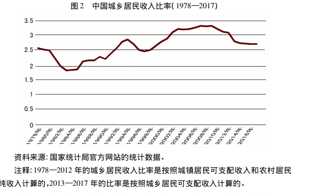
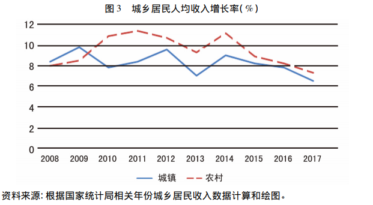

## 当前中国的收入分配状况
`李实. 当前中国的收入分配状况[J]. 学术界, 2018(3).`

### 近几年收入差距变动趋势

+ 中国收入差距的长期变动趋势分为两个阶段：

  - 经济转型前30年
  - 经济转型后10年。

- 2013年不公布基尼系数的原因是城乡居民收入定义不同。

- 不同数据库估计出来的基尼系数都各有不同。

### 现在的收入差距仍然过大

- 中国与其他国家的比较：

  2013年世界平均值为0.34，国家统计局估计的基尼系数为0.473。基尼系数大于中国的有8个经济体，中国排名第9。

  2015年世界基尼系数的平均值为0.393，高出平均值的经济体有21个，中国处在收入差距最大的15%国家中。

- 如何看待中国的收入差距问题：

  - 长期趋势。70年代末到80年代初，中国的基尼系数是0.3左右，90年代达到0.4,2008年据国家统计局估计接近0.5。因此改革开放以来收入不平等是大大加重的，虽然最近10年有所缓解。

  - 收入差距的结构。城乡收入差距是收入不平等中最重要的表现。在40年经济转型的过程中，城乡差距经历了缩小-扩大-再缩小的过程。三个时间点分别是1980年代、2009年、现在。2017年数据显示，城乡收入比为2.71.另外在公共服务上也有非可度量的差距。

  - 导致收入差距的原因。不公平和不合理的分配机制：城乡分割的户籍制度、劳动力市场各种歧视制度、与不同身份挂钩的有差异的社会福利与保障制度。

  ### 解释城乡之间过大的收入差距

- 解释一：市场化改革。但改革的问题不能解释这些收入差距的所有问题，真正有意义的改革是：农村土地产权改革和城乡户籍制度改革。
  - 进一步解释：计划经济时期城乡差距原因是工业化进程的需要，行政化配置造成了剪刀差和劳动力流动限制。经济转型时期收入差距的原因是农村剩余劳动力把工资压缩在生存线附近同时由于农村较少的公共基础设施投入造成了低收入-低人力资本-低收入的死循环。

### 未来收入差距的走向

- 对全国收入差距有所抑制的主要因素是公共政策的调整
  2003年的“三农”政策对收入差距的解决有所帮助，但是2015年之后农村居民收入增长仍然快于城镇居民，但二者增长率只差有所缩小，这意味着各种惠农政策在被稀释。

PS：

惠农政策如果都是针对农业活动，这种所谓的”稀释”是可以理解的，因为农民如果只依赖于农业活动可能城乡收入差距更大，
随着农民从事于非农活动（外出就业）这就意味着惠农政策已经到达天花板，而接下来如果继续缩小农民差距应该从惠及外出就业农民的收入的就业政策。又或者说提高城市低收入人群的政策。

- 扩大收入差距的因素：
  - 高收入人群的规模快速扩大，高收入群体的的水平和财富积累快速上升。

  - 居民财产分配的不平等程度急剧上升。

  PS:

农民财产较少，且可用于投资的资产较少，而且在农村地区没有比较好的市场也就是说即使在农村地区从事经营活动可能相对于城市地区的经营活动盈利性能力更差，因此农民的经营活动风险更高，所以农民的收入很容易停滞不前。

  - 现行收入分配政策的调节力度严重不足。
### 解决收入分配问题的关键点

- 初次分配和再次分配

- 工资谈判机制

- 对某些政策和制度进行改革和调整，如户籍制度和养老制度。
