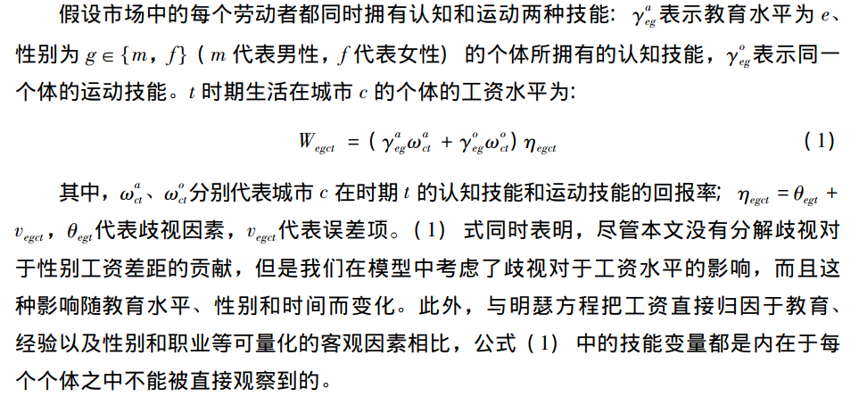
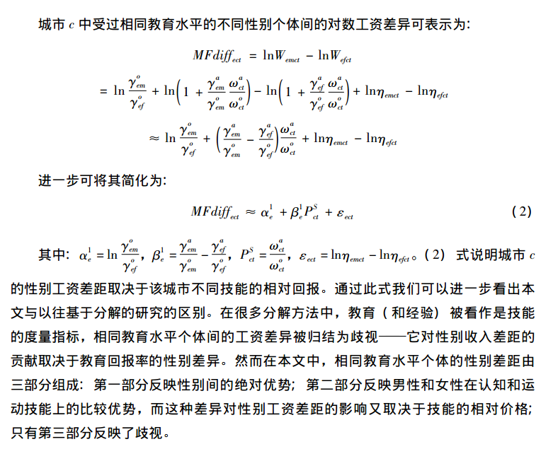
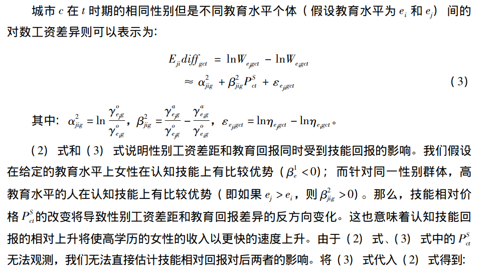
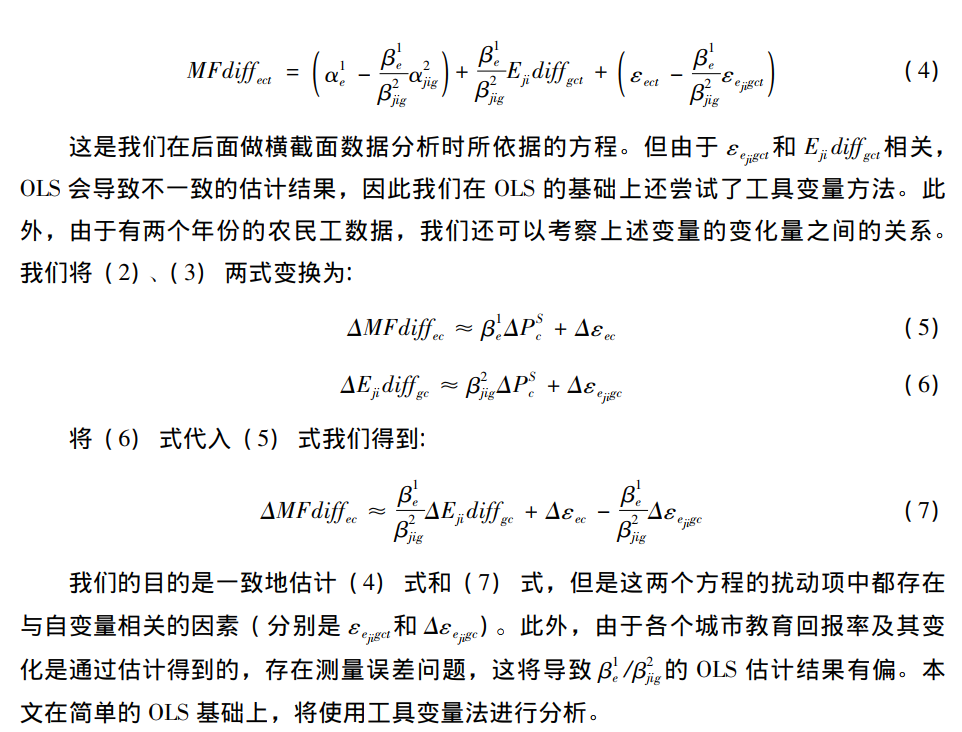
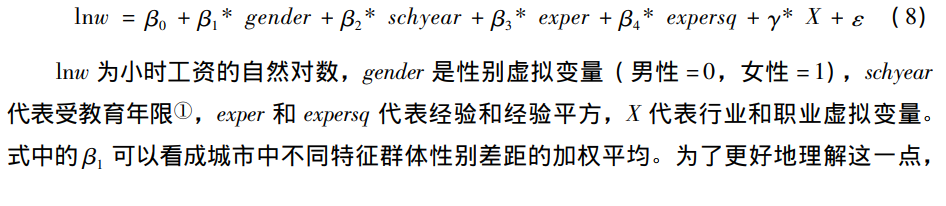
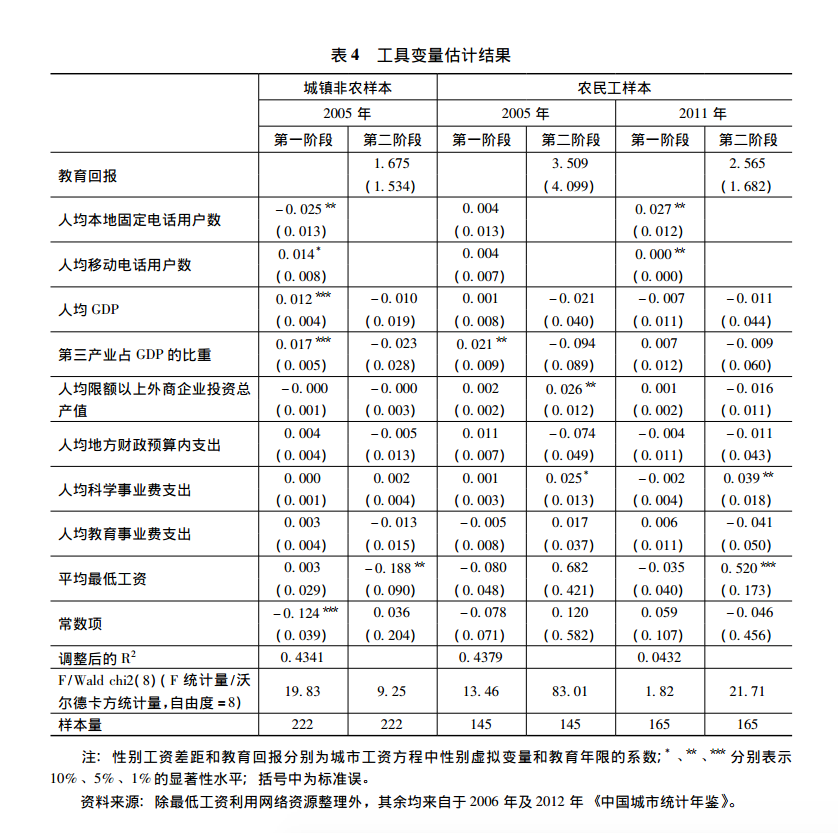
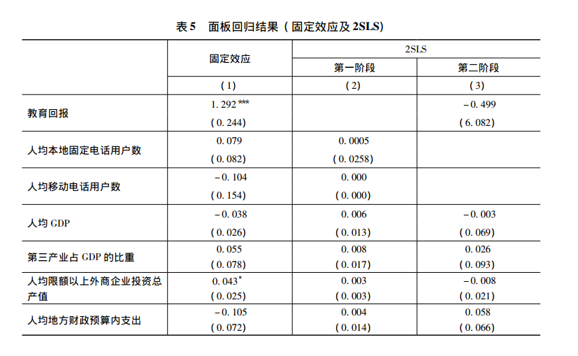

## 技术进步、教育回报与中国城镇地区的性别工资差距

`邢春冰, 贾淑艳, 李实. 技术进步、教育回报与中国城镇地区的性别工资差距[J]. 劳动经济研究, 2014(3):42-62.`

[TOC]

### 总结
本文是一篇实证文章，利用的是2005年1%的普查数据和2011年的流动人口监测数据。作者分别将连个数据库加总成县市层面的宏观数据，进而构造了一个两期的面板数据。作者发现教育水平越高的妇女，相对工资水平越高。因此作者得出结论，促进技术进步、提高教育回报有助于缩小中国城镇地区的性别工资差异。

### 几个性别工资差距的事实（基于中国劳动力市场）

- Gustafsson&Li(2000)发现，女性与男性工资比从1988年的84.4:100发展到1995年的82.5:100.
- 李实和马欣欣（2007）发现，上世纪末，在中国城镇地区的制造业和运输业工人中，性别工资比率甚至达到了63:100.

- 李实和宋锦（2013）发现，性别工资差距在2002-2007年之间有较为明显的上升。但该发现结果并不稳健。

- 上世纪90年代初以来，中国城镇地区的技能回报有了大幅度的上升（Zhang et al. , 2005;Meng et al. , 2010)

- 技能回报的变化即使经济转型和对外开放的结果，也是对技术进步的反应（Liu et al. 2010)。

### 模型设定







总的来看该文章的模型并没有太多新意的地方。只是拿教育和经验作为技能的代理，进而研究在不同技能水平上，性别的工资差异。而计量角度比较有意义的是内生性的解决。

#### 2SLS回归
教育回报对性别工资差距存在着反向影响，但是上述过程可能存在着内生性问题，即不可观测的因素对教育回报有影响。作者采用了人均固定电话用户数和人均移动电话用户数作为教育回报的工具变量。不过我们应该也会看到上面两个工具变量并不是好的工具变量，因为如果移动电话用户和固定电话用户数是和性别有关的，那么这就意味着这两个工具是直接和收入差距有关的。在2005年电话不太普及时，电话更多的是被收入较高的家庭或个人拥有，而一般男性劳动者是家庭收入的主要来源，所以如果一个人拥有移动电话那么移动电话的拥有者更有可能是男性；如果一个家庭拥有移动电话，那么这个家庭更有可能更有可能是高收入家庭，而该收入家庭又同时意味着男性的收入高于女性的收入。而一个城市的人均固定电话用户数和人均移动电话数越多，而该数字可能更多反应的是男性相对于女性的收入差距越大。因此这也解释了最终回归结果中教育回报的系数不显著。

**回归结果**



#### 面板回归



```
PS:

更好的工具变量是至关重要的。

```
