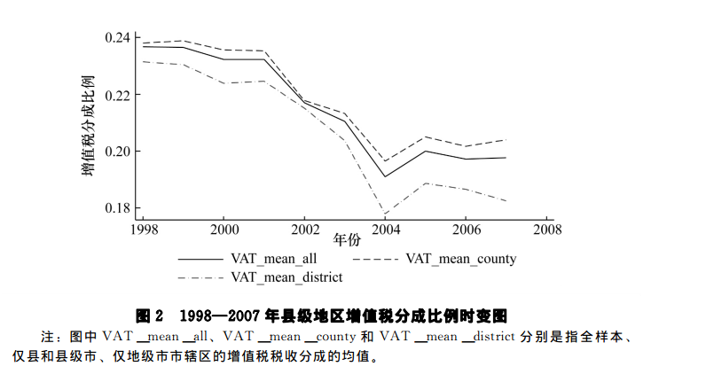
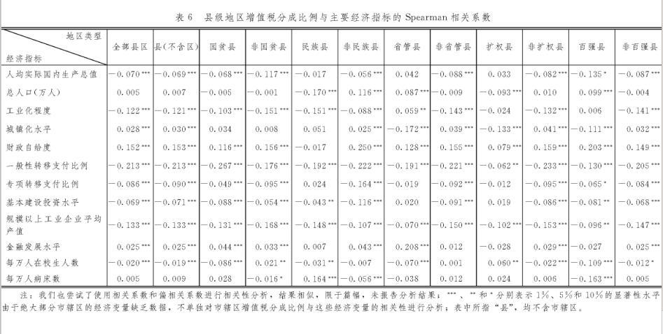

## 分税的事实:度量中国县级财政分权的数据基础

`毛捷, 吕冰洋, 陈佩霞. 分税的事实:度量中国县级财政分权的数据基础[J]. 经济学(季刊), 2018(2).`

文章总结了过去研究中财政分权指标的一些缺陷：

- 同分母问题
- 没有个人指标代表地区财力问题
- 财政收支的结构问题
- 数据主要集中为省级数据

文章使用了县级财政数据，分别用了县级自有企业所得税收入占总县级企业所得税收入的比例，及相似的营业税比例，做了描述性统计分析，得出的结论如下：
1. 省和地级市参与税收分成，导致县级政府税收分成比例降低。*分税制规定了中央和地方的分成比例，但是并没有规定地市和县级政府的所占比例。* 省和地级政府的参与使县级政府的分成比例降低了，尤其是2002年之后，县级地区税收比例下降幅度较大。原因可能是：相关税制改革（*2002年企业所得税分成改革和2004年的增值税转型改革*）对地方政府的财力产生了抑制。

2. 税收分成比例的分布呈现出一定的地区特征，县级地区的税收分成存在县高于区、中部和东部高于西部和东北、民族县高于非民族县。经济活力较强的地区（省直管县、经济扩权县、百强县）增值税比例分成较高。

3. 县级地区的经济发展水平、财政状况等经济指标与税收分成比例呈现显著关联。其中，经济发展水平与税收分成负相关，财政状况与税收分成呈正相关，而城镇化水平与税收分成的关系存在异质性。

文章提到的比较好的观点：
>为什么政府间事权或支出责任的划分没有成为中国财政分权的核心内容呢？
>
>我们认为，主要原因在于中国作为单一制国家，中央须保持对地方的控制力，政府间支出责任的分配不可避免地会存在大量交叉，难以截然划分清楚。举例来说，理论上认为基础教育应主要有地方政府负责，但是具体到支出项目上，它又分为教师工资、校舍改造和学生补助等，难以精确划分中央与地方的责任。
