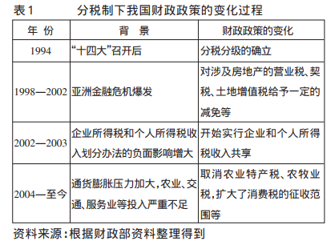

## 财政制度改革对中央与地方权力结构的影响——以财权和事权为视角

`汤火箭, 谭博文. 财政制度改革对中央与地方权力结构的影响——以财权和事权为视角[J]. 宏观经济研究, 2012(9):11-18.`

#### 事实

1. 根据国家财政收入与支出相关数据显示，尽管分税制是中央政府财政收支差额呈正向递增，然而地方政府财政手指的缺口却以更快的速度扩大。中央政府本机财政正的收支差额无法弥补地方政府本机财政负的差额，并且呈扩大趋势。

2. 若中央将所有正的盈余全部转移给地方，1994年地方政府有574.52亿元的资金缺口，而在2002年缺口扩大到3149.51亿元，2003年也达到2934.70亿元。

3. 面对财政缺口，地方政府选择举债或增加税费收入以弥补缺口。

### 我国政府财权与事权制度安排的变迁
1994年分税制改革之前，我国经历十多次调整。
- 1951年开始，国家逐步改变“统收统支”财政制度，向统一领导分级负责变化，把全国分为中央、大区、省三级预算，明确各级手指范围

- 1953年开始执行”一五”计划，中央决定地方政府可将结余自行留用。
- 1958年中央进一步下放财权，实行“以收定支，五年不变”的财政体制。
- 由于”大跃进”、自然灾害等原因，中央开始实行“总额分成，一年一变”的方针，最后将下放的权利陆续上收，逐渐加强集权。

- 文化大革命期间，我国财政制度在放权和收权中徘徊，先采取“收支两条线”、“财政大包干”，后收入采取“固定比例流程，超收另定分成比例”，支出采取”按指标包干”。

- 1976-1979年间，国家再次恢复了“收支挂钩，总额分成”的体质，并扩大地方的手指范围和管理权限。

- 1980年开始，我国实行分级包干财政体制，在中央领导和计划下，地方各过各的，地方政府的财政权限增大。
- 1985年，两步利改税完成，企业与政府关系完成转变，中央实行”划分税收、核定收支、分级包干”的体制，首次以税种来划分中央与地方财政收入。

- 1988-1993年间，中央未来制止“藏富于企业”的现象，对原来的包干办法进行了改进，不同的地方实行不同的包干方法，主要有以下几种：收入递增包干，总额分成，总额分成加增长分成，上解额递增包干，定额上解，定额补助。

--------
事权下放方面，并没有什么太大进展，1982年宪法的修改明确了中央与地方的职权划分，中央与地方的国家机构职权的划分。

-------------

**分税制下我国财政的变化过程**

分税制后，地方财政收入从原来占总财政收入的80%下降到45%，极大提高了中央政府对财政收入的支配能力和经济的管理能力。

**通过分税制改革，中央集中了50%-60%的财政收入，然而中央与地方在事权方面划分的格局并没有改变，而在单一政治体质和政府科层管理体制下，事权划分标准的模糊性使得中央或上级政府能够将事权层层下放至下级政府，因此政府财权与事权的不均衡随着事权的层层下放而越发严重。事权与财权的不匹配使分税制无法平衡地区间差异，更导致地方财源的缩减，迫使从预算外寻找收入来源。因此地方政府通过徒弟开发增加收入，缓解财政压力，“土地财政”导致了房地产过热带来的房价猛涨以及大规模基础建设的”政绩工程”，各种杂费也不断膨胀。**
